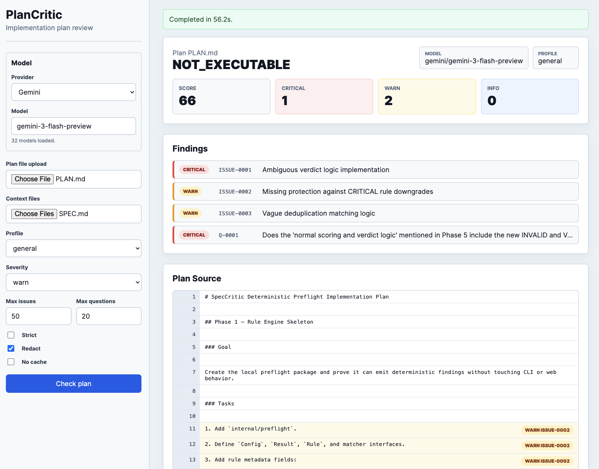

# PlanCritic

A CLI tool that reviews software implementation plans and returns structured critique: contradictions, ambiguities, missing prerequisites, questions, and suggested patches. Output is JSON-first (Markdown is rendered from JSON).

Designed for use by engineers and coding agents who want machine-readable feedback on a plan before execution begins.

## Installation

```bash
go install github.com/dshills/plancritic/cmd/plancritic@latest
```

Or build from source:

```bash
git clone https://github.com/dshills/plancritic.git
cd plancritic
go build -o plancritic ./cmd/plancritic
```

The optional web UI is a separate binary:

```bash
go build -o plancritic-web ./cmd/plancritic-web
```

## Configuration

Set an API key for your LLM provider:

```bash
# Anthropic (preferred)
export ANTHROPIC_API_KEY=sk-ant-...

# OpenAI
export OPENAI_API_KEY=sk-...
```

If both are set, Anthropic is used by default. Use `--model` to override.

Defaults are the current generation per provider: `claude-opus-5-5`, `gpt-5.2`, and
`gemini-2.5-flash`. For inner-loop iteration an agent can pass `--fast` to use the
cheaper tier (`claude-sonnet-5-5`, `gpt-5-mini`, `gemini-2.5-flash-lite`) and keep
the default for the final gate, and `--effort low|medium|high|xhigh|max` to trade
reasoning depth for speed and cost on models that support it (Anthropic
`output_config.effort`, OpenAI `reasoning_effort`, Gemini `thinkingLevel` on 3.x and a `thinkingBudget` on 2.5;
a model that rejects the control is retried without it). Both affect the result-cache key.

Gemini counts thinking against `--max-tokens`, and at Gemini 3's own default level
(`high`) `gemini-3-flash-preview` was measured thinking until the cap in two of three
runs, leaving too little room for the review. Without `--effort`, plancritic
therefore asks Gemini 3 for `medium`, which is much faster and shallower; pass
`--effort high` for deeper reviews. On Gemini 2.5 the budget never exceeds half of
`--max-tokens`. Verbose token lines show thinking separately as `+N reasoning`.

> **Privacy note:** Input content (plan and context files, after redaction) is sent to the configured model provider. Redaction is enabled by default.

## Usage

```bash
# Basic review (JSON output)
plancritic check plan.md

# Markdown report
plancritic check plan.md --format md

# Compact report for a coding agent: one line per finding, no quotes
plancritic check plan.md --format compact

# Zero-token local checks only (vague phrases, TODOs, empty sections, undefined phases)
plancritic lint plan.md --format compact

# Full JSON to a file, one-line verdict on stdout
plancritic check plan.md --out review.json --quiet

# With context files and a specific profile
plancritic check plan.md --context constraints.md --context tree.txt --profile go-backend

# Against the spec it implements: adds a requirement coverage matrix
plancritic check plan.md --spec SPEC.md

# Strict grounding mode (no assumptions about the codebase)
plancritic check plan.md --strict

# Write output to file
plancritic check plan.md --out review.json

# Generate patch suggestions (unified diff); patches are only produced when asked for
plancritic check plan.md --patch-out fixes.diff

# Also grade the profile's checklist items
plancritic check plan.md --profile go-backend --checklists

# CI mode: exit non-zero if verdict is not executable
plancritic check plan.md --fail-on not_executable

# Filter to warnings and above only
plancritic check plan.md --severity-threshold warn

# Override model
plancritic check plan.md --model anthropic/claude-opus-4-6

# Verbose output (shows each pipeline stage)
plancritic check plan.md --verbose
```

## Web UI

`plancritic-web` runs a local HTMX interface for reviewing uploaded plan files.



```bash
# Build the web binary
go build -o plancritic-web ./cmd/plancritic-web

# Start the server
./plancritic-web
```

By default it listens on `127.0.0.1:8080`. Open <http://127.0.0.1:8080>, choose a plan file, optionally add context files, then run the review. The web UI uses the same provider environment variables and review defaults as the CLI.

Common overrides:

```bash
# Listen on a different local port
./plancritic-web --addr 127.0.0.1:8100

# Set defaults shown in the form
./plancritic-web --provider openai --model gpt-5.2 --profile go-backend
```

## Flags

| Flag | Default | Description |
|------|---------|-------------|
| `--format` | `json` | Output format: `json`, `md`, or `compact` (one line per finding) |
| `--out` | stdout | Output file path |
| `--no-quotes` | false | Omit evidence quotes from `json`/`md` output; line references are kept |
| `--quiet` | false | Print only the one-line verdict summary to stdout (pair with `--out`) |
| `--plan <path>` | — | Plan file (alternative to the positional argument) |
| `--spec <path>` | — | The specification the plan implements; adds a coverage matrix (see below) |
| `--context <path>` | — | Additional grounding files (repeatable) |
| `--profile <name>` | `general` | Built-in checklist profile |
| `--strict` | false | Strict grounding mode (see below) |
| `--model <id>` | — | Model override (default: `claude-opus-5-5`, `gpt-5.2`, or `gemini-2.5-flash` by provider) |
| `--fast` | false | Use the provider's cheaper, faster tier (`claude-sonnet-5-5`, `gpt-5-mini`, `gemini-2.5-flash-lite`); ignored when `--model` is set |
| `--effort <level>` | — | Reasoning effort: `low`, `medium`, `high`, `xhigh`, `max` (default: the model's own) |
| `--max-tokens <n>` | 16384 | Cap LLM response size; a response that hits the cap is salvaged and flagged (`meta.truncated`) rather than failed |
| `--temperature <float>` | 0.2 | LLM temperature |
| `--seed <int>` | — | Seed for reproducibility (if supported) |
| `--severity-threshold` | `info` | Minimum severity to report; the model is told not to generate findings below it |
| `--patch-out <path>` | — | Ask the model for plan edits and write them as a unified diff |
| `--checklists` | false | Ask the model to grade every profile checklist item (PASS/FAIL/N/A) |
| `--no-lint` | false | Skip the local zero-token checks that run before the model |
| `--baseline <path>` | — | Earlier run's JSON output; adds a resolved/new/persisting delta to the result |
| `--fail-on <level>` | — | Exit code 2 if verdict meets/exceeds this level |
| `--redact` | true | Redact secrets before sending to model |
| `--no-cache` | false | Disable all caching: provider prompt caches and the local result cache |
| `--no-result-cache` | false | Always call the model, even when an identical run is cached locally |
| `--verbose` | false | Print pipeline steps |
| `--debug` | false | Save redacted prompt to local file |

## Profiles

Built-in profiles steer the critique with domain-specific checklists:

| Profile | Description |
|---------|-------------|
| `general` | Language-agnostic baseline (default) |
| `go-backend` | Go backend: minimal deps, explicit contracts, error handling, tests |
| `react-frontend` | React/TypeScript: components, state management, accessibility, bundle size |
| `aws-deploy` | AWS infrastructure: IAM least-privilege, networking, rollback, IaC, cost |
| `davin-go` | Opinionated Go backend house rules |

Profiles are embedded in the binary — no network access required.

## Strict Mode

With `--strict`, the model treats everything not present in the plan or context files as unknown:

- Issues must not claim "the repo uses X" unless it appears in provided context.
- Uncertain inferences are capped at WARN severity and tagged with `"assumption"`.
- A post-check scans descriptions for phrases suggesting fabricated repo knowledge ("the existing code", "the codebase uses", ...) and downgrades those issues from CRITICAL to WARN, tagging them `UNVERIFIED` plus `UNVERIFIED:<phrase>` so the reason is visible. A phrase that appears in the finding's own cited evidence is not flagged: quoting the plan's own claim is not fabrication.

Use strict mode when reviewing plans for unfamiliar codebases or when you want conservative, citation-only output.

## Local Lint (zero tokens)

`plancritic lint <plan>` runs only deterministic checks and never contacts a
provider: the profile's vague-phrase triggers ("fast", "robust", "etc.") and
contradiction pairs, unresolved placeholders (TODO, TBD, FIXME), empty sections,
duplicate headings, references to phases that are never defined, and phases with no
acceptance criteria. Every finding is INFO, non-blocking, and tagged `local`, with
`meta.model` set to `local/lint`. The output has the same shape as `check` and takes
the same output flags, so an agent can iterate on wording against `lint` for free and
reserve `check` for the real gate.

The same checks run at the start of every `check`: their findings are merged into the
review and listed in the prompt under "Already Flagged Locally" so the model does not
spend output tokens repeating them. `--no-lint` turns that off.

## Specification Coverage

Pass the spec the plan is meant to implement with `--spec`. It is sent as a context
file marked `role="spec"`, and the result gains a `coverage` block: one entry per
requirement found in the spec, with its spec citation, the plan lines that implement
it, and a status of `COVERED`, `PARTIAL` (with a note on what is missing), or
`UNCOVERED`, plus `out_of_scope` entries for plan work with no basis in the spec. The
`summary` counts are computed by the tool. This replaces the manual spec
cross-reference an agent would otherwise do by reading both documents itself.

```bash
plancritic check --plan specs/PLAN.md --spec specs/SPEC.md --format compact
```

Compact output prints a `COVERAGE` summary line followed by one line per `PARTIAL`,
`UNCOVERED`, or `OUT_OF_SCOPE` entry (covered requirements are only counted);
Markdown renders the full matrix as a table. Coverage entries are validated,
auto-fixed, and repaired like issues.

## Comparing Runs

Issue IDs are assigned fresh by the model on every run, so they cannot be used to
track a finding across revisions. Every issue and question therefore carries a
`fingerprint`: a hash of its category and the cited text (not the line numbers, so
edits elsewhere in the plan do not disturb it). Pass an earlier run's JSON output
with `--baseline` and the result gains a `delta` block listing which findings were
resolved, which persist, and which are new, plus the score change:

```bash
plancritic check PLAN.md --out run1.json
# ... revise PLAN.md ...
plancritic check PLAN.md --baseline run1.json --format compact
```

In compact output each finding is tagged `[new]` or `[persisting]`, resolved
findings appear as `RESOLVED` lines, and the header gains
`new=… persisting=… resolved=… score_change=…`. Any earlier JSON output works as a
baseline, even one produced before fingerprints existed, as long as it kept its
evidence quotes (fingerprints are recomputed from them).

## Compact Format

`--format compact` is for coding agents that already have the plan in context and
pay for every token they read back. It is deterministic plain text, one line per
finding, with `file:line` references instead of quoted text and no markup:

```
VERDICT EXECUTABLE_WITH_CLARIFICATIONS score=72 critical=1 warn=2 info=0
ISSUE-0001 CRITICAL(blocking) CONTRADICTION PLAN.md:L4-6,SPEC.md:L12 "Dependency-free claim contradicts library use" -> Drop the libraries or remove the claim.
ISSUE-0002 WARN TEST_GAP PLAN.md:L20 "No tests named" -> List the tests per phase.
Q-0001 WARN PLAN.md:L30-31 "Which auth provider?" -> Blocks step 3.
CHECK TESTING pass=2 fail=1 na=0
CHECK TESTING FAIL "Are tests mapped to acceptance criteria?"
```

The first line is always the verdict summary; `cached`, `truncated`, and
`degenerate` markers are appended when they apply. `--quiet` prints just that line to stdout, which pairs
with `--out` for the full report. `--no-quotes` strips evidence quotes from the
`json` and `md` formats while keeping line references.

## Timeouts and Retries

`--timeout` (default `5m`) bounds the whole model call, including retries. Transient
provider failures (HTTP 408, 429, 500, 502, 503, 504, 529, and dropped connections)
are retried up to three times with exponential backoff and jitter, honoring a
`Retry-After` header when the provider sends one. Validation errors (other 4xx) are
never retried. `--verbose` prints each retry with its reason and delay.

## Result Cache

Every completed review is stored locally, keyed by a hash of the exact prompt
(redacted plan and context text, profile, strict mode, caps) together with the
provider, model, temperature, seed, and max-tokens settings. Re-running with
identical inputs returns the stored review in milliseconds with no provider
call and no tokens billed; the output carries `"meta": {"cached": true}`.

Output-only flags (`--format`, `--out`, `--no-quotes`, `--quiet`, `--baseline`,
`--fail-on`) are applied on top of the cached review, so changing them does not
trigger a new model call. Any change to the plan, context files, profile, model
settings, or `--severity-threshold` (which is told to the model so it does not
generate findings you will discard) produces a new key and a fresh review.

- Entries expire after 7 days.
- Location: `$XDG_CACHE_HOME/plancritic/results` (Linux), `~/Library/Caches/plancritic/results` (macOS). Set `PLANCRITIC_CACHE_DIR` to relocate it.
- `--no-result-cache` (or `PLANCRITIC_NO_RESULT_CACHE=1`) forces a model call for one run. `--no-cache` disables this cache and provider-side prompt caching together.
- Incomplete or suspect reviews are never stored. A response truncated at `--max-tokens` is not cached. Neither is a *degenerate* response: for a plan longer than 50 lines, the model returned no issues and no questions (and, with `--spec`, no coverage requirements). This has been seen as a rare bad sample at `--effort low`. plancritic retries such a response once. If the retry is normal, it is used and cached as usual. If the retry is also empty, the review is returned uncached, with `"meta": {"degenerate": true}` and a WARN issue `ISSUE-EMPTY-RESPONSE` (tagged `system`), so the next identical run asks the model again.

Provider-side prompt caching is separate: the static prefix (rules, schema, profile)
and the context files are marked as cache breakpoints so a re-run after editing the
plan only pays full price for the plan. `--cache-ttl` (default `1h`) sets the cache
lifetime: Anthropic uses its 1-hour tier for any value of an hour or more (otherwise
the 5-minute default), and Gemini's context cache uses the exact value. Agent loops
usually pause longer than five minutes between runs, which is why the default is an
hour.

Every fresh review reports what it cost in `meta.usage` (`calls`, `input_tokens`,
`output_tokens`, and, when caching applied, `cache_read_input_tokens` and
`cache_creation_input_tokens`); the compact header shows the same as `in=… out=…`.
A result-cache hit has no `usage`. If `cache_read_input_tokens` stays at zero across
re-runs, something in the prefix is changing between runs.

## Output Format

The model is held to a JSON Schema at the provider level wherever the provider
supports it (Anthropic `output_config` on Sonnet 5 / Opus 5 / Haiku 4.5 and later,
OpenAI strict `json_schema`, Gemini `responseJsonSchema`); other models get the
same schema as prompt text. Citations are then checked against the real files:
mechanical slips (duplicate IDs, inverted or overlong line ranges) are fixed locally,
and anything else is sent back for repair as a delta containing only the offending
items.

JSON output follows a strict schema:

```json
{
  "tool": "plancritic",
  "version": "1.0",
  "input": {
    "plan_file": "plan.md",
    "plan_hash": "sha256:...",
    "context_files": [],
    "profile": "general",
    "strict": false
  },
  "summary": {
    "verdict": "EXECUTABLE_WITH_CLARIFICATIONS",
    "score": 72,
    "critical_count": 2,
    "warn_count": 5,
    "info_count": 7
  },
  "questions": [ ... ],
  "issues": [ ... ],
  "patches": [ ... ],
  "meta": {
    "model": "anthropic/claude-opus-4-6",
    "temperature": 0.2
  }
}
```

### Verdicts

| Verdict | Meaning |
|---------|---------|
| `EXECUTABLE_AS_IS` | Plan is clear and complete enough to hand off |
| `EXECUTABLE_WITH_CLARIFICATIONS` | Minor gaps; answering questions unblocks execution |
| `NOT_EXECUTABLE` | Critical blockers; plan must be revised first |

### Score

Score is computed deterministically: start at 100, subtract 20 per CRITICAL, 7 per WARN, 2 per INFO, clamped at 0.

### Issue Categories

`CONTRADICTION`, `AMBIGUITY`, `MISSING_PREREQUISITE`, `MISSING_ACCEPTANCE_CRITERIA`, `RISK_SECURITY`, `RISK_DATA`, `RISK_OPERATIONS`, `TEST_GAP`, `SCOPE_CREEP_RISK`, `UNREALISTIC_STEP`, `ORDERING_DEPENDENCY`, `UNSPECIFIED_INTERFACE`, `NON_DETERMINISM`

Every issue includes evidence citations with line numbers and quoted excerpts from the plan.

## Exit Codes

| Code | Meaning |
|------|---------|
| 0 | Success, verdict below fail threshold |
| 2 | Verdict meets/exceeds `--fail-on` threshold |
| 3 | Input error (missing file, bad format) |
| 4 | Model/provider error |
| 5 | Schema validation error (model returned invalid JSON) |

## Examples

See the [`examples/`](examples/) directory for a sample plan, JSON review output, and Markdown report.

## License

MIT — see [LICENSE](LICENSE).
